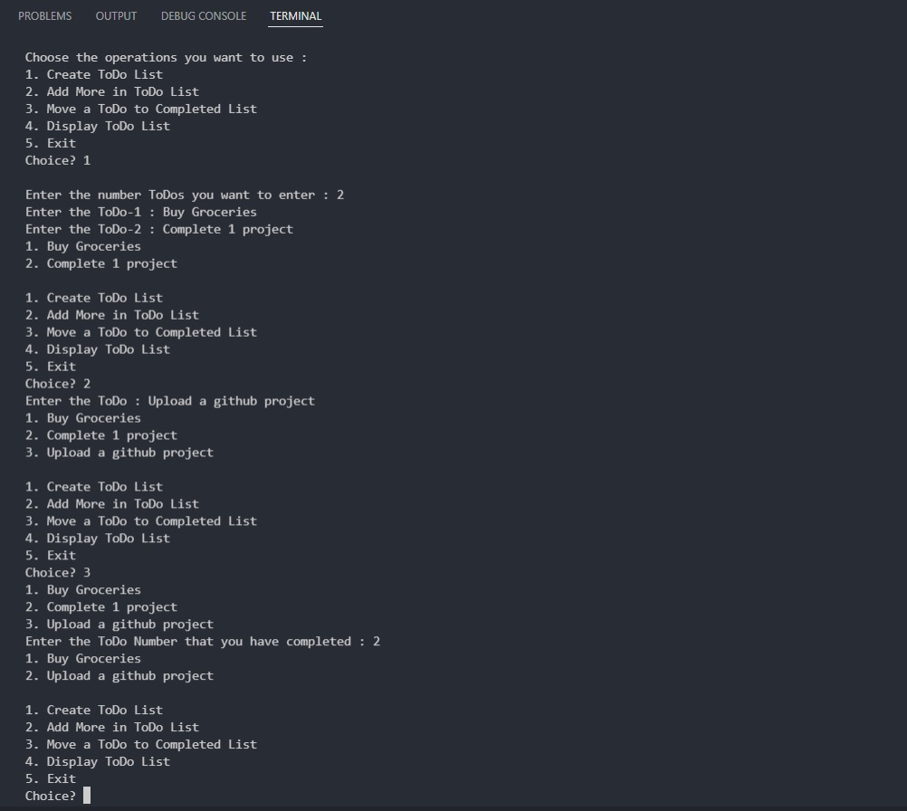

# Aditya Raj

## Table of Contents
* [General Info](#general-information)
* [Technologies Used](#technologies-used)
* [Features](#features)
* [Screenshots](#screenshots)
* [Setup](#setup)
* [Project Status](#project-status)
* [Contact](#contact)

## General Information
A program which take notes of your todos, and also create a folder named after the
modified date and stores the todos in text file.

## Technologies Used
- Python

## Features
- Simple UI
- User-friendly

## Screenshots

## Setup
Extract the given zipped file. You may use Winrar for this. 
Open the extracted folder and click on `todo.py` file to open the code in code editor.
Run this python file from your respective code editor or from command line.

## Project Status
 _completed_

## Contact
- Project By: **Aditya Raj**.
- <a href="mailto:araj.mishra2000@gmail.com">Email Me</a>
